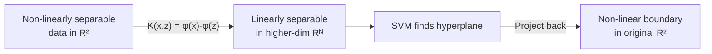
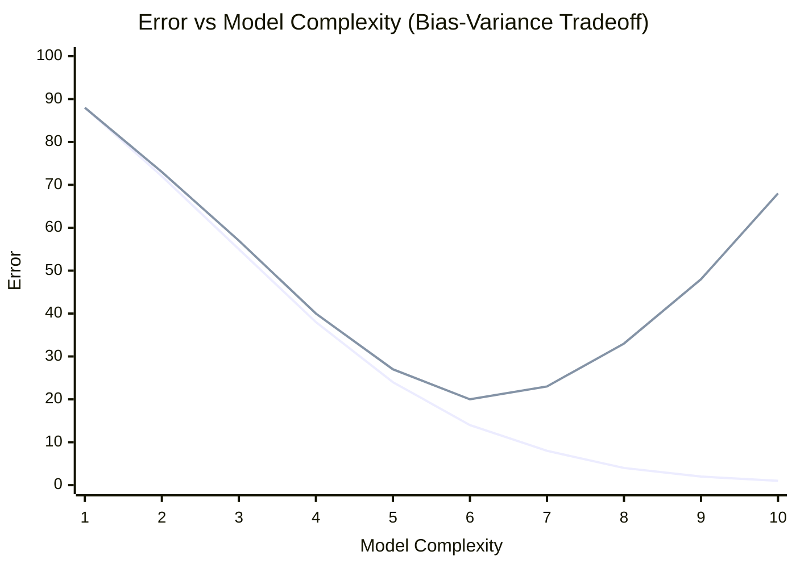
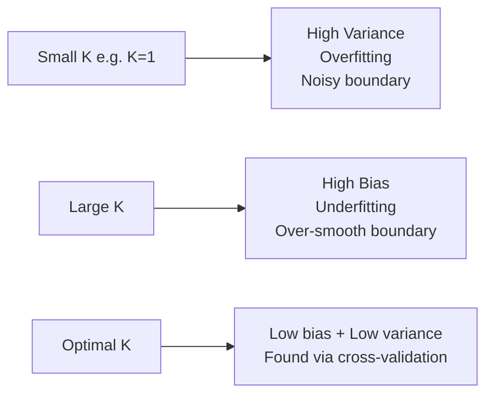
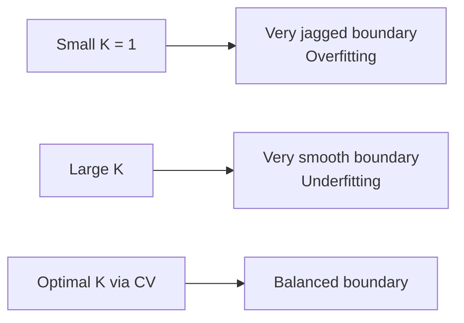
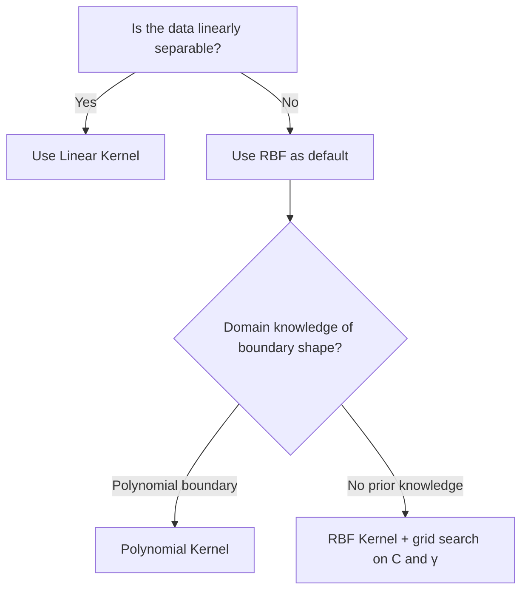
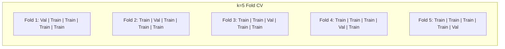
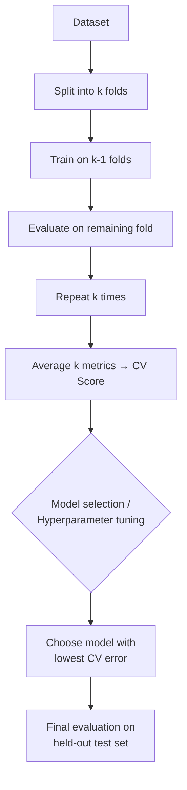

### Part-A

#### 1. Find the eigenvalue and eigenvector for the matrix: $A = \begin{bmatrix} 2 & 1 \\ 1 & 2 \end{bmatrix}$

**Characteristic equation:** $\det(A - \lambda I) = 0$

$$\det\begin{bmatrix} 2-\lambda & 1 \ 1 & 2-\lambda \end{bmatrix} = (2-\lambda)^2 - 1 = 0$$

$$\lambda^2 - 4\lambda + 3 = 0 \implies (\lambda - 1)(\lambda - 3) = 0$$

**Eigenvalues:** $\lambda_1 = 1$, $\lambda_2 = 3$

**Eigenvector for $\lambda_1 = 1$:** Solve $(A - I)v = 0$

$$\begin{bmatrix} 1 & 1 \ 1 & 1 \end{bmatrix}v = 0 \implies v_1 = \begin{bmatrix} 1 \ -1 \end{bmatrix}$$

**Eigenvector for $\lambda_2 = 3$:** Solve $(A - 3I)v = 0$

$$\begin{bmatrix} -1 & 1 \ 1 & -1 \end{bmatrix}v = 0 \implies v_2 = \begin{bmatrix} 1 \ 1 \end{bmatrix}$$

---

#### 2. A spam detection dataset contains 1000 emails, where 300 are spam. Compute the prior probability of spam and not spam. If an algorithm randomly selects an email, what is the probability it is spam?

$$P(\text{spam}) = \frac{300}{1000} = 0.3$$

$$P(\text{not spam}) = \frac{700}{1000} = 0.7$$

The probability a randomly selected email is spam = **0.3** (same as the prior, since selection is uniform random).

---

#### 3. Describe overfitting. How does cross-validation help to reduce it?

**Overfitting** occurs when a model learns the training data too well - including noise and random fluctuations - resulting in high training accuracy but poor generalization to unseen data. It reflects high variance and low bias.

**Cross-validation** (typically k-fold) splits the dataset into $k$ equal folds. The model trains on $k-1$ folds and validates on the remaining fold; this repeats $k$ times. The average validation error across all folds gives a reliable estimate of generalization performance. Since the model is evaluated on data it never trained on in each fold, overfitting to a single train-test split is avoided and model selection is more reliable.

---

#### 4. Define Bayes' theorem.

Bayes' theorem expresses the posterior probability of event $A$ given event $B$:

$$P(A \mid B) = \frac{P(B \mid A) \cdot P(A)}{P(B)}$$

where $P(A)$ is the prior, $P(B \mid A)$ is the likelihood, $P(B)$ is the marginal probability (evidence), and $P(A \mid B)$ is the posterior.

---

#### 5. Compare and contrast generative and discriminative models.

|Aspect|Generative Models|Discriminative Models|
|---|---|---|
|What it models|Joint distribution $P(X, Y)$|Conditional $P(Y \mid X)$|
|Can generate new data|Yes|No|
|Decision boundary|Indirect (via joint dist.)|Direct|
|Data requirement|More|Less|
|Classification accuracy|Generally lower|Generally higher|
|Examples|Naive Bayes, HMM, VAE|Logistic Regression, SVM, Neural Networks|

---

#### 6. Compute the projection of $A$ over $B$, where $A = [3, 14]$ and $B = [1, 0]$.

$$\text{proj}_B(A) = \frac{A \cdot B}{|B|^2} \cdot B = \frac{(3)(1) + (14)(0)}{1^2 + 0^2} \cdot [1, 0] = 3 \cdot [1, 0] = \mathbf{[3, 0]}$$

---

#### 7. Discuss gradient descent optimization.

Gradient descent is an iterative first-order optimization algorithm used to minimize a cost function $J(\theta)$. At each step, the parameters are updated in the direction opposite to the gradient:

$$\theta := \theta - \alpha \cdot \nabla_\theta J(\theta)$$

where $\alpha$ is the **learning rate** controlling step size. Variants:

- **Batch GD** - uses entire dataset per update; stable but slow.
- **Stochastic GD (SGD)** - uses one sample per update; noisy but fast.
- **Mini-batch GD** - compromise; most commonly used in practice.

---

#### 8. Illustrate the K-Nearest Neighbour algorithm. Mention one limitation.

KNN is a non-parametric, lazy learning algorithm. For a new input point $x$:

1. Compute distance from $x$ to all training points.
2. Select the $K$ nearest neighbors.
3. Assign the majority class among the $K$ neighbors (classification) or compute their mean (regression).

**Limitation:** Computationally expensive at prediction time - $O(n \cdot d)$ per query where $n$ = number of training samples and $d$ = number of features. Becomes infeasible for large datasets.

---

#### 9. Illustrate the role of kernel functions in Support Vector Machines.

Many real-world datasets are not linearly separable in the original feature space. Kernel functions enable SVMs to implicitly map input data to a higher-dimensional feature space $\phi(x)$ where a linear separator exists, without explicitly computing the mapping. This is the **kernel trick**:

$$K(x_i, x_j) = \phi(x_i) \cdot \phi(x_j)$$

Since the SVM dual formulation relies only on dot products, replacing them with $K(\cdot, \cdot)$ allows non-linear classification efficiently. Common kernels: Linear, Polynomial, RBF (Gaussian).

---

#### 10. Define supervised learning.

Supervised learning is a type of machine learning where a model is trained on a labeled dataset of input-output pairs ${(x_i, y_i)}_{i=1}^n$. The goal is to learn a mapping $f: X \to Y$ such that for a new input $x$, the model can predict $\hat{y} = f(x)$ accurately. Examples: classification and regression.

---

#### 11. List any two applications of Machine Learning.

1. **Spam email detection** - classifying emails as spam or not based on content features.
2. **Medical image diagnosis** - detecting tumors or abnormalities in X-rays and MRI scans using CNNs.

---

#### 12. Differentiate classification and regression.

|Aspect|Classification|Regression|
|---|---|---|
|Output type|Discrete class labels|Continuous numerical values|
|Goal|Assign categories|Predict quantity|
|Example|Spam / Not Spam|House price prediction|
|Algorithms|Logistic Regression, SVM, KNN|Linear Regression, Ridge, Lasso|
|Evaluation metrics|Accuracy, F1-Score, AUC|MSE, RMSE, $R^2$|

---

#### 13. State Bayes' theorem.

$$P(A \mid B) = \frac{P(B \mid A) \cdot P(A)}{P(B)}$$

where $P(B) = \sum_i P(B \mid A_i) \cdot P(A_i)$ (total probability).

---

#### 14. Given the vectors $x = (2, -1, 3)$ and $y = (1, 4, -2)$, find the dot product.

$$x \cdot y = (2)(1) + (-1)(4) + (3)(-2) = 2 - 4 - 6 = \mathbf{-8}$$

---

#### 15. Define a generative model.

A generative model learns the joint probability distribution $P(X, Y)$ over inputs and labels, or the distribution $P(X)$ for unsupervised tasks. It models how the data is generated, and can produce new synthetic samples resembling training data. Examples: Naive Bayes, Hidden Markov Models, Variational Autoencoders, GANs.

---

#### 16. Explain the least squares method.

The least squares method finds model parameters that minimize the sum of squared residuals between observed and predicted values:

$$\min_\beta \sum_{i=1}^n (y_i - \hat{y}_i)^2$$

For linear regression, the closed-form solution (Normal Equation) is:

$$\hat{\beta} = (X^T X)^{-1} X^T Y$$

This gives the globally optimal solution when $X^TX$ is invertible.

---

#### 17. Describe the distance metric used in KNN.

KNN commonly uses the following distance metrics:

- **Euclidean distance:** $d(x, y) = \sqrt{\sum_{i=1}^n (x_i - y_i)^2}$ - most common, sensitive to scale.
- **Manhattan distance:** $d(x, y) = \sum_{i=1}^n |x_i - y_i|$ - robust to outliers.
- **Minkowski distance:** $d(x, y) = \left(\sum_{i=1}^n |x_i - y_i|^p\right)^{1/p}$ - generalization; $p=1$ gives Manhattan, $p=2$ gives Euclidean.

---

#### 18. Analyze the role of hyperparameters in Machine Learning.

Hyperparameters are configuration parameters set **before training** and not learned from data. They control the learning process and model complexity. Examples: learning rate $\alpha$, $K$ in KNN, $C$ and $\gamma$ in SVM, tree depth in decision trees, number of hidden layers in neural networks.

Hyperparameters are tuned using:

- **Grid search** - exhaustive search over a defined parameter grid.
- **Random search** - random sampling from parameter distributions.
- **Bayesian optimization** - builds a surrogate model to guide search.

All evaluated using cross-validation to avoid overfitting to the validation set.

---

#### 19. Define overfitting and underfitting.

**Overfitting:** The model learns training data too well, including noise. It has high training accuracy but poor test accuracy (high variance, low bias). Occurs with overly complex models.

**Underfitting:** The model is too simple to capture the underlying patterns. It performs poorly on both training and test data (high bias, low variance). Occurs with overly simplified models.

---

#### 20. List any two advantages of Support Vector Machines.

1. **Effective in high-dimensional spaces** - works well even when the number of features exceeds the number of training samples.
2. **Memory efficient** - only support vectors (a subset of training points) influence the decision boundary, reducing memory usage.

---

### Part-B

#### 1. Explain classification using Logistic Regression and Support Vector Machines.

##### Logistic Regression

###### Core Idea

Linear regression outputs values in $(-\infty, +\infty)$, unsuitable for classification. Logistic Regression squashes the linear output into a probability using the **sigmoid function**:

$$\sigma(z) = \frac{1}{1 + e^{-z}}, \quad z = w^T x + b$$

$$P(y = 1 \mid x) = \sigma(w^T x + b), \qquad P(y = 0 \mid x) = 1 - \sigma(w^T x + b)$$

The sigmoid maps any real number to $(0, 1)$, making it interpretable as a probability.

###### Sigmoid Curve

```
P(y=1)
 1.0 |                          ___________
     |                    ____/
 0.5 |_________________ /  <-- decision threshold
     |              __/
 0.0 |_____________/
      <- negative z       z=0       positive z ->
```

- When $z \gg 0$: $\sigma(z) \to 1$ (predict class 1)
- When $z \ll 0$: $\sigma(z) \to 0$ (predict class 0)
- When $z = 0$: $\sigma(z) = 0.5$ (on the decision boundary)

###### Decision Boundary

The decision boundary is where $P(y=1 \mid x) = 0.5$, which occurs at $z = 0$:

$$w^T x + b = 0$$

This is a hyperplane in feature space. In 2D it is a line; in 3D it is a plane.

**Example (2D):** If $w = [2, -1]^T$, $b = -3$, boundary is $2x_1 - x_2 - 3 = 0$.

```
x2
 |          . . class 1
 |        . .
 |  ------/-----  <- w^Tx + b = 0
 |      /  * *
 |    /  * *  class 0
 +-----------> x1
```

###### Loss Function - Binary Cross-Entropy

MSE is non-convex with sigmoid, so **log loss** is used instead:

$$J(w, b) = -\frac{1}{n} \sum_{i=1}^n \left[ y_i \log \hat{y}_i + (1 - y_i) \log(1 - \hat{y}_i) \right]$$

**Intuition:** If $y_i = 1$ and $\hat{y}_i \to 1$: loss $\to 0$. If $y_i = 1$ and $\hat{y}_i \to 0$: loss $\to \infty$. This loss is convex in $w$, guaranteeing a global minimum.

###### Gradient Descent Update

$$\frac{\partial J}{\partial w} = \frac{1}{n} X^T(\hat{y} - y)$$

$$w := w - \alpha \cdot \frac{\partial J}{\partial w}, \qquad b := b - \alpha \cdot \frac{\partial J}{\partial b}$$

###### Regularization

- **L2 (Ridge):** $J_{\text{reg}} = J + \dfrac{\lambda}{2}|w|^2$ - shrinks all weights smoothly.
- **L1 (Lasso):** $J_{\text{reg}} = J + \lambda|w|_1$ - drives some weights to zero (sparse model).

###### Multi-class Extension

- **One-vs-Rest (OvR):** Train $k$ binary classifiers; assign class with highest confidence.
- **Softmax Regression:** $P(y = c \mid x) = \dfrac{e^{w_c^T x}}{\sum_{j=1}^k e^{w_j^T x}}$

##### Support Vector Machine (SVM)

###### Core Idea

Logistic Regression picks any separating hyperplane. SVM picks the unique **maximum-margin hyperplane** - the one furthest from all training points of both classes.

###### Geometry of the Hyperplane and Margin

```
         Margin = 2 / ||w||
         |<----------------->|

Class +1:  o   o             Support Vector -> o
                  o
           -------------------  <- w^Tx + b = +1
           ===== BOUNDARY =====  <- w^Tx + b =  0
           -------------------  <- w^Tx + b = -1
                  x          Support Vector -> x
Class -1:  x   x
```

**Support vectors** are training points lying exactly on the $\pm 1$ margin boundaries. Only these points influence the hyperplane.

**Distance from hyperplane to a point:** $d = \dfrac{|w^T x + b|}{|w|}$

**Full margin** (from $+1$ boundary to $-1$ boundary): $\text{margin} = \dfrac{2}{|w|}$

Maximizing margin $\equiv$ minimizing $|w|$ $\equiv$ minimizing $\dfrac{1}{2}|w|^2$.

###### Why SVM's Hyperplane is Better

```
Multiple valid hyperplanes      SVM picks maximum-margin one
(logistic regression)

  o  o                           o  o
     o  /  /  /                     o  |
    o  /  /  /  x                  o  |  x
       /  /  /  x  x                  |  x  x
      /  /  /                         |
```

The maximum-margin hyperplane has the highest geometric confidence and generalizes better.

###### Hard Margin SVM

For linearly separable data:

$$\min_{w, b} \frac{1}{2}|w|^2 \quad \text{subject to} \quad y_i(w^T x_i + b) \geq 1 \quad \forall i$$

###### Soft Margin SVM

For non-separable data, slack variables $\xi_i \geq 0$ allow margin violations:

$$\min_{w, b, \xi} \frac{1}{2}|w|^2 + C \sum_{i=1}^n \xi_i \quad \text{subject to} \quad y_i(w^T x_i + b) \geq 1 - \xi_i$$

**Meaning of $\xi_i$:**

- $\xi_i = 0$: correctly classified, outside margin.
- $0 < \xi_i \leq 1$: inside margin but on the correct side.
- $\xi_i > 1$: misclassified.

**Role of $C$:**

|$C$|Effect|
|---|---|
|Large|High violation penalty - narrow margin - overfitting risk|
|Small|Low violation penalty - wide margin - better generalization|

###### Dual Formulation and the Kernel Trick

The primal is converted to a **Lagrangian dual** using multipliers $\alpha_i \geq 0$:

$$\max_\alpha \sum_i \alpha_i - \frac{1}{2}\sum_i\sum_j \alpha_i \alpha_j y_i y_j (x_i \cdot x_j) \quad \text{s.t.} \quad \sum_i \alpha_i y_i = 0,\ 0 \leq \alpha_i \leq C$$

Inputs appear **only as dot products** $x_i \cdot x_j$. This is what makes the kernel trick possible.

**The Kernel Trick:** Map data to a higher-dimensional space $\phi(x)$ where linear separation is possible. Instead of computing $\phi(x_i) \cdot \phi(x_j)$ explicitly, use a kernel function:

$$K(x_i, x_j) = \phi(x_i) \cdot \phi(x_j)$$

Replace every $x_i \cdot x_j$ in the dual with $K(x_i, x_j)$. No explicit computation of $\phi(x)$ needed.



###### Common Kernels

**Linear:** $K(x, z) = x \cdot z$ - no transformation; standard SVM.

**Polynomial:** $K(x, z) = (x \cdot z + c)^d$

For $d=2$, $c=1$, $x=(x_1,x_2)$: implicit $\phi(x) = [1,\ \sqrt{2}x_1,\ \sqrt{2}x_2,\ x_1^2,\ x_2^2,\ \sqrt{2}x_1 x_2]$. The kernel computes this dot product without ever forming $\phi(x)$ explicitly.

**RBF (Gaussian):** $K(x, z) = \exp\left(-\gamma |x - z|^2\right)$

- $K \approx 1$ when $x \approx z$; $K \approx 0$ when far apart.
- Feature space is infinite-dimensional.
- Large $\gamma$: narrow influence, complex boundary, overfitting risk.
- Small $\gamma$: wide influence, smooth boundary, underfitting risk.

**Decision function (kernel SVM):**

$$f(x) = \text{sign}\left(\sum_{i \in SV} \alpha_i y_i K(x_i, x) + b\right)$$

Only support vectors (where $\alpha_i > 0$) appear - making inference memory-efficient.

##### Comparison

|Aspect|Logistic Regression|SVM|
|---|---|---|
|Output|Probability $\in (0,1)$|Class label ${+1,-1}$|
|Hyperplane selection|Any valid separator|Unique maximum-margin separator|
|Decision boundary|Probabilistic, soft|Geometric, hard|
|Non-linear data|Requires manual feature engineering|Kernel trick handles implicitly|
|Training cost|$O(nd)$ - fast|$O(n^2)$ to $O(n^3)$ - quadratic programming|
|Interpretability|High|Low|
|Kernel support|No (by default)|Yes|
|Regularization|L1 / L2 on loss|$C$ on margin|

---

#### 2. Explain any three types of discrete probability distribution functions.

##### 1. Bernoulli Distribution

Models a single binary trial (success/failure).

$$P(X = k) = p^k (1-p)^{1-k}, \quad k \in {0, 1}$$

- $P(X=1) = p$, $P(X=0) = 1-p$
- **Mean:** $\mu = p$ | **Variance:** $\sigma^2 = p(1-p)$
- **Example:** Whether a single email is spam (1) or not (0).

---

##### 2. Binomial Distribution

Models the number of successes in $n$ independent Bernoulli trials.

$$P(X = k) = \binom{n}{k} p^k (1-p)^{n-k}, \quad k = 0, 1, \ldots, n$$

- **Mean:** $\mu = np$ | **Variance:** $\sigma^2 = np(1-p)$
- **Example:** Number of spam emails in a batch of 100 emails, each independently having $P(\text{spam}) = 0.3$.

---

##### 3. Poisson Distribution

Models the number of events occurring in a fixed interval of time or space, given a known average rate $\lambda$.

$$P(X = k) = \frac{e^{-\lambda} \lambda^k}{k!}, \quad k = 0, 1, 2, \ldots$$

- **Mean:** $\mu = \lambda$ | **Variance:** $\sigma^2 = \lambda$
- **Example:** Number of customer service requests arriving per hour when the average rate is $\lambda = 5$.
- Approximates Binomial when $n$ is large and $p$ is small ($\lambda = np$).

---

#### 3. Medical test Bayes' theorem problem.

**Given:**

- $P(D) = 0.05$ - prior probability of disease
- $P(+ \mid D) = 0.90$ - true positive rate (sensitivity)
- $P(+ \mid \bar{D}) = 0.10$ - false positive rate

**Find:** $P(D \mid +)$

**Step 1: Compute $P(+)$ using Total Probability Theorem**

$$P(+) = P(+ \mid D) \cdot P(D) + P(+ \mid \bar{D}) \cdot P(\bar{D})$$

$$P(+) = (0.90)(0.05) + (0.10)(0.95) = 0.045 + 0.095 = 0.14$$

**Step 2: Apply Bayes' Theorem**

$$P(D \mid +) = \frac{P(+ \mid D) \cdot P(D)}{P(+)} = \frac{0.045}{0.14} \approx \mathbf{0.321}$$

**Interpretation:** Even though the test has 90% sensitivity, a person who tests positive has only a **32.1% chance** of actually having the disease. This is because the disease prevalence is very low (5%) - the majority of positive tests come from healthy individuals (false positives). This demonstrates the importance of base rate (prior probability) when interpreting diagnostic tests.

---

#### 4. Multiple linear regression using Normal Equation.

**Model:** $y = \beta_0 + \beta_1 X_1 + \beta_2 X_2$

##### Step 1: Matrix Form

$$Y = X\beta, \quad \text{where } \hat{\beta} = (X^TX)^{-1}X^TY$$

Design matrix $X$ (with intercept column of 1s):

$$X = \begin{bmatrix} 1 & 1 & 4 \ 1 & 2 & 5 \ 1 & 3 & 6 \ 1 & 4 & 8 \end{bmatrix}, \quad Y = \begin{bmatrix} 50 \ 60 \ 65 \ 80 \end{bmatrix}$$

##### Step 2: Compute $X^TX$

$$X^TX = \begin{bmatrix} \sum 1 & \sum X_1 & \sum X_2 \ \sum X_1 & \sum X_1^2 & \sum X_1X_2 \ \sum X_2 & \sum X_1X_2 & \sum X_2^2 \end{bmatrix}$$

- $\sum 1 = 4$, $\sum X_1 = 10$, $\sum X_2 = 4+5+6+8 = 23$
- $\sum X_1^2 = 1+4+9+16 = 30$, $\sum X_1 X_2 = 4+10+18+32 = 64$
- $\sum X_2^2 = 16+25+36+64 = 141$

$$X^TX = \begin{bmatrix} 4 & 10 & 23 \ 10 & 30 & 64 \ 23 & 64 & 141 \end{bmatrix}$$

##### Step 3: Compute $X^TY$

$$X^TY = \begin{bmatrix} \sum y \ \sum X_1 y \ \sum X_2 y \end{bmatrix} = \begin{bmatrix} 50+60+65+80 \ 50+120+195+320 \ 200+300+390+640 \end{bmatrix} = \begin{bmatrix} 255 \ 685 \ 1530 \end{bmatrix}$$

##### Step 4: Compute $\det(X^TX)$

$$\det = 4(30 \cdot 141 - 64^2) - 10(10 \cdot 141 - 64 \cdot 23) + 23(10 \cdot 64 - 30 \cdot 23)$$

$$= 4(4230 - 4096) - 10(1410 - 1472) + 23(640 - 690)$$

$$= 4(134) - 10(-62) + 23(-50) = 536 + 620 - 1150 = \mathbf{6}$$

##### Step 5: Compute $(X^TX)^{-1}$ via Adjugate

Cofactors:

$$C_{11} = 134, \quad C_{12} = 62, \quad C_{13} = -50$$ $$C_{21} = 62, \quad C_{22} = 35, \quad C_{23} = -26$$ $$C_{31} = -50, \quad C_{32} = -26, \quad C_{33} = 20$$

$$\text{adj}(X^TX) = \begin{bmatrix} 134 & 62 & -50 \ 62 & 35 & -26 \ -50 & -26 & 20 \end{bmatrix}$$

$$(X^TX)^{-1} = \frac{1}{6}\begin{bmatrix} 134 & 62 & -50 \ 62 & 35 & -26 \ -50 & -26 & 20 \end{bmatrix}$$

##### Step 6: Compute $\hat{\beta} = (X^TX)^{-1}X^TY$

Numerator $= \text{adj}(X^TX) \cdot X^TY$:

$$\beta_0 \text{ numerator} = 134(255) + 62(685) + (-50)(1530) = 34170 + 42470 - 76500 = 140$$

$$\beta_1 \text{ numerator} = 62(255) + 35(685) + (-26)(1530) = 15810 + 23975 - 39780 = 5$$

$$\beta_2 \text{ numerator} = (-50)(255) + (-26)(685) + 20(1530) = -12750 - 17810 + 30600 = 40$$

$$\hat{\beta} = \frac{1}{6}\begin{bmatrix} 140 \ 5 \ 40 \end{bmatrix} = \begin{bmatrix} 70/3 \ 5/6 \ 20/3 \end{bmatrix} \approx \begin{bmatrix} 23.33 \ 0.83 \ 6.67 \end{bmatrix}$$

##### Final Regression Equation:

$$\boxed{\hat{y} = 23.33 + 0.83,X_1 + 6.67,X_2}$$

**Verification (row 4):** $\hat{y} = 23.33 + 0.83(4) + 6.67(8) = 23.33 + 3.32 + 53.36 = 80.01 \approx 80$ ✓

---

#### 5. Compare underfitting and overfitting with a neat diagram.

##### Conceptual Comparison

|Aspect|Underfitting|Good Fit|Overfitting|
|---|---|---|---|
|Bias|High|Low|Low|
|Variance|Low|Low|High|
|Training error|High|Low|Very Low|
|Test/Val error|High|Low|High|
|Cause|Model too simple|Balanced complexity|Model too complex|
|Example model|Linear fit on quadratic data|Appropriate polynomial|Very high-degree polynomial|

##### Bias-Variance Tradeoff Diagram



> The optimal model complexity is at the minimum of the Test/Val Error curve. Left of this point is the **underfitting** region; right of it is the **overfitting** region.

##### Curve Fitting Illustration

```
Underfitting          Good Fit           Overfitting
(High Bias)           (Balanced)         (High Variance)

 *    *               *    *                *    *
  *  *                 * *                   *
   **          -->      *          vs          *
  *  *                 * *                  *   *
 *    *               *    *               *     *

Straight line fit   Smooth curve fit   Wiggly curve passes
misses all data     follows trend      through every point
```

##### Key Takeaway

- Underfitting: increase model complexity, add features, reduce regularization.
- Overfitting: add more data, regularization (L1/L2), dropout, pruning, cross-validation.

---

#### 6. Illustrate the concept of Generalized Linear Models (GLMs) and Support Vector Machines (SVMs) as classification techniques.

##### Generalized Linear Models (GLMs)

GLMs extend ordinary linear regression to handle response variables from the **exponential family** of distributions (not just Gaussian). They are used for classification when the output is categorical.

**Three components of a GLM:**

1. **Random component** - specifies the distribution of $Y$: Binomial, Poisson, Gaussian, Gamma, etc.
2. **Systematic component** - linear predictor: $\eta = X\beta = \beta_0 + \beta_1 x_1 + \ldots + \beta_p x_p$
3. **Link function** $g(\mu)$ - connects the mean of $Y$ to the linear predictor: $g(\mu) = \eta$, where $\mu = E[Y]$.

**GLM for Classification - Logistic Regression:**

|Component|Value|
|---|---|
|Distribution|Binomial|
|Link function|Logit: $g(\mu) = \log\dfrac{\mu}{1-\mu}$|
|Mean function|$\mu = \dfrac{1}{1+e^{-\eta}} = \sigma(\eta)$|
|Output|$P(Y=1 \mid X) \in [0,1]$|

The logit link ensures predictions stay in $[0,1]$. Decision rule: predict class 1 if $P(Y=1 \mid X) \geq 0.5$.

**Other GLMs:**

|GLM Type|Distribution|Link|Use|
|---|---|---|---|
|Linear Regression|Gaussian|Identity|Continuous output|
|Logistic Regression|Binomial|Logit|Binary classification|
|Poisson Regression|Poisson|Log|Count data|
|Multinomial Logistic|Multinomial|Softmax|Multi-class classification|

**Training GLMs:** Maximum Likelihood Estimation (MLE) using Iteratively Reweighted Least Squares (IRLS) or gradient descent.

---

##### Support Vector Machines (SVMs) as a Classifier

SVM is a **discriminative** classifier that finds the optimal separating hyperplane between classes by maximizing the geometric margin.

**Linear SVM:**

Decision boundary: $w^T x + b = 0$

Support vectors satisfy: $y_i(w^T x_i + b) = 1$

Margin $= \dfrac{2}{|w|}$. Maximizing margin $\equiv$ minimizing $\dfrac{1}{2}|w|^2$.

**Primal Optimization:**

$$\min_{w,b} \frac{1}{2}|w|^2 \quad \text{s.t.} \quad y_i(w^Tx_i + b) \geq 1 \quad \forall i$$

**Dual Formulation** (using Lagrange multipliers $\alpha_i \geq 0$):

$$\max_\alpha \sum_i \alpha_i - \frac{1}{2}\sum_i\sum_j \alpha_i \alpha_j y_i y_j x_i^T x_j$$

$$\text{s.t.} \quad \sum_i \alpha_i y_i = 0, \quad \alpha_i \geq 0$$

Only support vectors (with $\alpha_i > 0$) contribute to the decision function. This makes SVM memory efficient.

**Non-linear SVM via Kernels:**

Replace $x_i^T x_j$ with $K(x_i, x_j)$ in the dual. Common kernels: Polynomial $(x \cdot z + c)^d$ and RBF $\exp(-\gamma|x-z|^2)$.

**Comparison - GLM vs SVM:**

|Aspect|GLM (Logistic Regression)|SVM|
|---|---|---|
|Probabilistic output|Yes|No (by default)|
|Margin maximization|No|Yes|
|Kernel support|No|Yes|
|Interpretability|High|Low|
|Works well on|Small, structured data|High-dimensional, complex data|

---

#### 7. Explain the working principle of the K-Nearest Neighbour (KNN) algorithm. Discuss the advantages and limitations of KNN as an instance-based learning method.

##### What is Instance-Based Learning?

KNN is an **instance-based** (or memory-based) learner. Unlike eager learners (e.g., decision trees, logistic regression) that build an explicit global model during training, KNN is a **lazy learner** - it defers all computation to query time and makes predictions by consulting stored training instances directly.

##### KNN Algorithm

**Training phase:** Simply store all training data ${(x_i, y_i)}_{i=1}^n$. No model is built.

**Prediction phase for a new query point $x_q$:**

1. Compute distance from $x_q$ to every training point $x_i$.
2. Sort training points by distance and select the $K$ nearest.
3. **Classification:** Assign the majority class among the $K$ neighbors.
4. **Regression:** Assign the mean (or weighted mean) of the $K$ neighbors' values.

$$\hat{y} = \arg\max_c \sum_{x_i \in \mathcal{N}_K(x_q)} \mathbf{1}[y_i = c] \quad \text{(classification)}$$

##### Distance Metrics

$$d_{\text{Euclidean}}(x, y) = \sqrt{\sum_{j=1}^d (x_j - y_j)^2}$$

$$d_{\text{Manhattan}}(x, y) = \sum_{j=1}^d |x_j - y_j|$$

$$d_{\text{Minkowski}}(x, y) = \left(\sum_{j=1}^d |x_j - y_j|^p\right)^{1/p}$$

##### Choosing $K$



- Small $K$: decision boundary is jagged, sensitive to noise.
- Large $K$: decision boundary is overly smooth, may miss local patterns.
- Cross-validation (e.g., leave-one-out) is used to find optimal $K$.

##### Example Walkthrough

Given training points and $K=3$, to classify a new point $x_q$:

1. Compute distances to all training points.
2. Pick 3 nearest: say 2 are class A, 1 is class B.
3. Majority vote → predict class A.

##### Advantages of KNN

1. **Simple to understand and implement** - no complex training procedure.
2. **No training time (lazy learner)** - model "training" is just storing data.
3. **Naturally handles multi-class problems** - majority vote works directly.
4. **Non-parametric** - makes no assumptions about the underlying data distribution.
5. **Adapts automatically** - adding new training data requires no retraining.
6. **Decision boundary adapts to data** - can model complex non-linear boundaries.

##### Limitations of KNN

1. **High prediction cost:** $O(n \cdot d)$ per query - scales poorly with large datasets.
2. **High memory usage:** must store entire training dataset.
3. **Curse of dimensionality:** in high-dimensional spaces, all points become equidistant, making $K$ neighbors meaningless.
4. **Sensitive to irrelevant features:** noisy or irrelevant dimensions distort distance computation.
5. **Requires feature scaling:** Euclidean distance is not scale-invariant; features must be normalized.
6. **Imbalanced data:** majority class dominates the vote; requires weighted KNN or resampling.

---

#### 8. Describe and justify the importance of Machine Learning applications in healthcare.

Machine Learning is transforming healthcare by enabling data-driven, automated, and scalable solutions across clinical, operational, and research domains.

##### Key Applications

**1. Medical Imaging and Diagnostics** Convolutional Neural Networks (CNNs) analyze X-rays, MRIs, and CT scans to detect tumors, fractures, and retinal diseases (e.g., diabetic retinopathy detection with >90% accuracy). They reduce diagnostic time significantly.

**2. Disease Prediction and Early Detection** ML models trained on patient history, lab results, and vitals can predict onset of conditions like diabetes, sepsis, or heart failure before clinical symptoms appear, enabling preventive care.

**3. Drug Discovery and Development** ML accelerates identification of drug candidates by predicting protein-ligand binding affinity, toxicity, and bioavailability - reducing the time and cost of traditional wet-lab methods.

**4. Personalized Medicine** Models analyze genomic data, lifestyle, and biomarkers to tailor treatments to individual patients, including cancer therapy selection and dosage optimization.

**5. Clinical NLP - EHR Analysis** NLP models extract structured information from unstructured Electronic Health Records (EHRs) - diagnoses, medications, risk factors - enabling population health management.

**6. ICU and Hospital Operations** Predictive models estimate ICU readmission risk, length of stay, and surgical complications, enabling resource planning.

##### Justification

|Factor|Benefit|
|---|---|
|Volume of data|Healthcare generates terabytes of EHR, imaging, and genomic data - ML handles this scale.|
|Pattern recognition|ML discovers correlations invisible to human experts.|
|Speed|Inference in milliseconds vs. hours of clinical review.|
|Consistency|No fatigue or cognitive bias in prediction.|

##### Challenges

- Data privacy regulations (HIPAA, GDPR) restrict data sharing.
- Model explainability is critical in clinical settings; black-box models are unacceptable.
- Data quality and class imbalance (rare diseases) affect model reliability.
- Regulatory approval (FDA clearance) required for clinical deployment.

---

#### 9. Analyze the advantages, disadvantages and challenges in implementing Machine Learning models.

##### Advantages of Machine Learning

**1. Automation of Complex Tasks** ML automates tasks that are too complex for rule-based systems - image recognition, natural language understanding, anomaly detection - reducing human labor.

**2. Scalability** Once trained, ML models infer on millions of samples per second, scaling effortlessly with modern hardware (GPUs, TPUs).

**3. Continuous Improvement** Online learning systems improve as more data arrives, adapting to changing patterns without full retraining.

**4. Pattern Discovery in High-Dimensional Data** ML finds non-obvious patterns in complex, high-dimensional datasets (genomics, financial markets) that are beyond human analytical capacity.

**5. Versatility** A single framework (e.g., deep learning) is applicable across domains: vision, NLP, audio, tabular data, time series.

**6. Real-time Predictions** Deployed models generate predictions in milliseconds, enabling real-time applications like fraud detection and autonomous driving.

---

##### Disadvantages of Machine Learning

**1. Data Dependency** ML models require large volumes of high-quality, labeled data. Performance degrades sharply with insufficient or biased data.

**2. Computational Cost** Training large models (especially deep learning) requires significant compute resources, time, and energy.

**3. Black-box Nature** Most ML models (especially neural networks) are not interpretable. Decisions cannot be easily explained, which is problematic in regulated industries.

**4. Susceptibility to Bias** If training data reflects historical biases (racial, gender), models perpetuate and amplify them.

**5. Overfitting** Complex models memorize training data and fail to generalize, especially with small datasets.

**6. High Maintenance** Models degrade over time as real-world data distribution shifts (concept drift), requiring periodic retraining and monitoring.

---

##### Challenges in Implementation

|Challenge|Description|
|---|---|
|Data Quality|Missing values, inconsistencies, label noise impair model performance.|
|Feature Engineering|Selecting/transforming the right input features requires domain expertise.|
|Model Selection|Choosing the right algorithm for a given task is non-trivial.|
|Hyperparameter Tuning|Suboptimal hyperparameters lead to poor performance; tuning is expensive.|
|Scalability|Scaling training pipelines to distributed systems introduces engineering complexity.|
|Interpretability|Regulatory and ethical requirements demand explainable models.|
|Adversarial Attacks|Malicious perturbations to inputs can fool ML models with high confidence.|
|Concept Drift|Deployed models face shifting data distributions over time.|
|Ethical and Fairness Concerns|Models may produce discriminatory outcomes.|
|Regulatory Compliance|Healthcare, finance, and legal domains have strict deployment requirements.|

---

#### 10. Given $P(A) = 0.4$, $P(B \mid A) = 0.7$, and $P(B \mid \bar{A}) = 0.2$:

##### (i) Find $P(B)$

Using the **Total Probability Theorem:**

$$P(B) = P(B \mid A) \cdot P(A) + P(B \mid \bar{A}) \cdot P(\bar{A})$$

$$P(B) = (0.7)(0.4) + (0.2)(0.6) = 0.28 + 0.12 = \mathbf{0.40}$$

##### (ii) Find $P(A \mid B)$

Using **Bayes' Theorem:**

$$P(A \mid B) = \frac{P(B \mid A) \cdot P(A)}{P(B)} = \frac{(0.7)(0.4)}{0.40} = \frac{0.28}{0.40} = \mathbf{0.70}$$

---

#### 11. Apply Bayes' theorem to explain how email spam filtering works.

##### Setup

Let:

- $S$ = event that an email is spam
- $H$ = event that an email is ham (not spam)
- $W_i$ = email contains word $i$

The goal: compute $P(S \mid W_1, W_2, \ldots, W_n)$ for a new email.

##### Naive Bayes Spam Filter

By Bayes' theorem:

$$P(S \mid W_1, \ldots, W_n) = \frac{P(W_1, \ldots, W_n \mid S) \cdot P(S)}{P(W_1, \ldots, W_n)}$$

The **Naive Bayes assumption** assumes words are conditionally independent given the class:

$$P(W_1, \ldots, W_n \mid S) = \prod_{i=1}^n P(W_i \mid S)$$

So the classifier becomes:

$$P(S \mid W_1,\ldots,W_n) \propto P(S) \cdot \prod_{i=1}^n P(W_i \mid S)$$

##### Training Phase

From a labeled dataset of spam and ham emails:

$$P(W_i \mid S) = \frac{\text{count of emails with word } W_i \text{ in spam}}{\text{total spam emails}}$$

Similarly compute $P(W_i \mid H)$, $P(S)$, $P(H)$.

Laplace smoothing is applied to avoid zero probabilities for unseen words.

##### Classification Phase

For a new email with words $W_1, \ldots, W_n$:

- Compute $\text{score}(S) = \log P(S) + \sum_i \log P(W_i \mid S)$
- Compute $\text{score}(H) = \log P(H) + \sum_i \log P(W_i \mid H)$
- Classify as spam if $\text{score}(S) > \text{score}(H)$

(Log-space is used to avoid floating-point underflow from multiplying many small probabilities.)

##### Numerical Example

Suppose: $P(S) = 0.3$, $P(\text{"win"} \mid S) = 0.80$, $P(\text{"win"} \mid H) = 0.10$

$$P(S \mid \text{"win"}) = \frac{0.80 \times 0.30}{0.80 \times 0.30 + 0.10 \times 0.70} = \frac{0.24}{0.31} \approx 0.774$$

Email with word "win" has 77.4% probability of being spam - classified as spam.

##### Flow

```mermaid
flowchart LR
    A[New Email] --> B[Tokenize words]
    B --> C{Compute P(S|words)\nand P(H|words)}
    C --> D{P(S|words) >\nthreshold?}
    D -- Yes --> E[Spam]
    D -- No --> F[Ham / Inbox]
```

---

#### 12. Analyze the problems of underfitting and overfitting and discuss methods to overcome them.

##### The Problem of Overfitting

Overfitting occurs when a model captures noise and random fluctuations in the training data instead of the true underlying pattern. Symptoms:

- Very low training error, high validation/test error.
- Large gap between training and test accuracy.
- Occurs with: overly complex models, too few training samples, too many features, too long training.

**Why it happens:** The model has sufficient capacity to memorize training data rather than generalize.

##### The Problem of Underfitting

Underfitting occurs when the model is too simple to represent the underlying data distribution. Symptoms:

- High training error AND high test error.
- Poor performance on both seen and unseen data.
- Occurs with: overly simple models, insufficient features, too much regularization, too few training iterations.

##### Bias-Variance Decomposition

Total expected error $= \text{Bias}^2 + \text{Variance} + \text{Irreducible Noise}$

||Bias|Variance|
|---|---|---|
|Underfitting|High|Low|
|Good fit|Low|Low|
|Overfitting|Low|High|

##### Methods to Overcome Overfitting

**1. Regularization**

- **L2 (Ridge):** Adds $\lambda |w|^2$ to loss, shrinks weights towards zero.
- **L1 (Lasso):** Adds $\lambda |w|_1$ to loss, promotes sparsity (feature selection).
- **Elastic Net:** Combines L1 and L2.

$$J_{\text{regularized}} = J + \lambda \Omega(w)$$

**2. More Training Data** More data reduces variance; the model cannot memorize all samples.

**3. Cross-Validation** Detect overfitting early by evaluating on held-out folds.

**4. Early Stopping** During iterative training, stop when validation error starts increasing.

**5. Dropout (Neural Networks)** Randomly drop neurons during training, preventing co-adaptation.

**6. Data Augmentation** Generate synthetic training samples (rotation, flipping for images) to effectively increase dataset size.

**7. Ensemble Methods (Bagging)** Train multiple models on bootstrap samples and aggregate predictions (e.g., Random Forest) - reduces variance.

**8. Model Simplification** Reduce model complexity (fewer layers, lower polynomial degree, pruning decision trees).

##### Methods to Overcome Underfitting

1. **Increase model complexity** - use higher-degree polynomials, deeper networks.
2. **Feature engineering** - add relevant features, interaction terms.
3. **Reduce regularization** - lower $\lambda$.
4. **Train longer** - more epochs / gradient descent iterations.
5. **Use a more powerful model** - switch from linear to non-linear (SVM with kernel, neural network).

---

#### 13. Explain instance-based learning and the K-Nearest Neighbour algorithm.

##### Instance-Based Learning

Instance-based learning (IBL) is a family of algorithms that:

- Do **not** construct an explicit, generalized model during training.
- Store training instances directly (memory-based).
- Construct the hypothesis locally at query time by examining nearby training instances.
- Also called **lazy learning** - all heavy computation is deferred to prediction time.

**Contrast with Eager Learning:**

|Aspect|Lazy (Instance-Based)|Eager (Model-Based)|
|---|---|---|
|Training time|None / minimal|Significant|
|Prediction time|Slow ($O(n)$)|Fast ($O(1)$)|
|Memory|Stores all data|Stores only parameters|
|Adaptability|Immediate (add new points)|Requires retraining|
|Examples|KNN, LWR, Case-Based Reasoning|SVM, Neural Networks, Decision Trees|

**Key property:** IBL can represent multiple, complex local decision boundaries simultaneously, since each query uses its own local neighborhood for inference.

##### K-Nearest Neighbour Algorithm

**Algorithm Steps:**

```
INPUT: Training set D = {(x_i, y_i)}, Query point x_q, K
1. For each (x_i, y_i) in D:
     Compute d(x_q, x_i) using chosen distance metric
2. Sort training points by d(x_q, x_i) ascending
3. Select K nearest neighbors: N_K(x_q)
4a. Classification: ŷ = argmax_c |{x_i in N_K : y_i = c}|  (majority vote)
4b. Regression: ŷ = (1/K) Σ y_i for x_i in N_K(x_q)
OUTPUT: Predicted label ŷ
```

**Weighted KNN:** Closer neighbors contribute more:

$$\hat{y} = \frac{\sum_{i \in N_K} w_i \cdot y_i}{\sum_{i \in N_K} w_i}, \quad w_i = \frac{1}{d(x_q, x_i)}$$

##### Decision Boundary



##### Feature Preprocessing

Since KNN relies on distance, **feature normalization is mandatory:**

$$x_j' = \frac{x_j - \mu_j}{\sigma_j} \quad \text{(z-score normalization)}$$

Without normalization, features with large scales dominate the distance computation.

##### Curse of Dimensionality

As dimensions $d$ increase, the volume of the space grows exponentially. To capture $k$ neighbors, the neighborhood ball must grow so large it no longer represents "local" behavior. Data becomes sparse and all pairwise distances converge to the same value, making KNN unreliable. Dimensionality reduction (PCA) is often applied before KNN.

---

#### 14. Explain the concept of kernel functions in Support Vector Machines. Discuss the role of polynomial and Radial Basis Function (RBF) kernels.

##### The Need for Kernels

Linear SVMs find a maximum-margin hyperplane in the original input space. However, many real-world datasets are not linearly separable. The solution is to map inputs to a higher-dimensional feature space $\phi: \mathbb{R}^d \to \mathbb{R}^D$ where linear separation becomes possible.

**Problem:** Explicitly computing $\phi(x)$ can be computationally infeasible (even infinite-dimensional).

##### The Kernel Trick

The SVM dual formulation involves only dot products $x_i^T x_j$. If we replace every dot product with a kernel function:

$$K(x_i, x_j) = \phi(x_i) \cdot \phi(x_j)$$

we gain the benefit of the high-dimensional mapping without ever computing $\phi(x)$ explicitly. This is the **kernel trick**.

**Decision function with kernel:**

$$f(x) = \text{sign}\left(\sum_{i=1}^n \alpha_i y_i K(x_i, x) + b\right)$$

##### Mercer's Condition

A function $K: \mathbb{R}^d \times \mathbb{R}^d \to \mathbb{R}$ is a valid kernel if and only if the **Gram matrix** $K_{ij} = K(x_i, x_j)$ is **positive semi-definite** for any set of inputs. This guarantees the existence of a corresponding feature map $\phi$.

##### Polynomial Kernel

$$K(x, z) = (x \cdot z + c)^d$$

where $d$ is the polynomial degree and $c \geq 0$ is a free parameter.

**What it does:** Creates a feature space containing all polynomial combinations of input features up to degree $d$.

**Example (degree 2, $c=1$, 2D input $x = (x_1, x_2)$):**

$$K(x,z) = (x_1 z_1 + x_2 z_2 + 1)^2$$

The implicit feature map is:

$$\phi(x) = [1, \sqrt{2}x_1, \sqrt{2}x_2, x_1^2, x_2^2, \sqrt{2}x_1x_2]$$

**When to use:** Data with polynomial decision boundaries. For text classification (interaction of words). Degree $d=1$ reduces to the linear kernel.

**Hyperparameters:** $d$ (degree) and $c$ (intercept) - tuned via cross-validation. Higher $d$ increases model complexity (risk of overfitting).

##### Radial Basis Function (RBF) / Gaussian Kernel

$$K(x, z) = \exp\left(-\gamma |x - z|^2\right), \quad \gamma = \frac{1}{2\sigma^2}$$

**What it does:** Measures similarity as a Gaussian function of Euclidean distance. The feature space is **infinite-dimensional**.

- $K(x, z) \to 1$ when $x \approx z$ (very similar)
- $K(x, z) \to 0$ when $|x - z| \to \infty$ (very different)

**Role of $\gamma$:**

|$\gamma$|Effect|
|---|---|
|Large $\gamma$ (narrow Gaussian)|Points must be very close to be similar; complex, tight boundary; risk of overfitting|
|Small $\gamma$ (wide Gaussian)|Long-range influence; smoother boundary; risk of underfitting|

**When to use:** General-purpose; works well when no prior knowledge of data structure. Most commonly used kernel in practice.

##### Kernel Comparison

|Kernel|Formula|Feature Space|Hyperparameters|
|---|---|---|---|
|Linear|$x \cdot z$|Original space|None|
|Polynomial|$(x \cdot z + c)^d$|Degree-$d$ polynomial space|$d$, $c$|
|RBF|$\exp(-\gamma\|x-z\|^2)$|Infinite-dimensional|$\gamma$|
|Sigmoid|$\tanh(\alpha x \cdot z + c)$|Neural net-like|$\alpha$, $c$|

##### Kernel Selection Guidance



##### The $C$ and $\gamma$ Tradeoff (RBF-SVM)

- Large $C$ + large $\gamma$: overfitting risk.
- Small $C$ + small $\gamma$: underfitting risk.
- Grid search on ${C, \gamma}$ with cross-validation is standard practice.

---

#### 15. Explain the concept of cross-validation. Discuss how it helps in model selection and prevents overfitting.

##### What is Cross-Validation?

Cross-validation (CV) is a statistical technique for evaluating a model's generalization ability by testing it on data not seen during training. It provides a more reliable performance estimate than a single train-test split.

**Core idea:** Use different parts of the data as training and validation sets multiple times, then average the results.

##### Types of Cross-Validation

**1. Holdout Validation** Split data into fixed training (e.g., 80%) and test (20%) sets. Simple but high variance - result depends on the random split.

**2. k-Fold Cross-Validation (Most Common)**



**Procedure:**

1. Partition dataset $D$ into $k$ equal folds $F_1, F_2, \ldots, F_k$.
2. For $i = 1$ to $k$:
    - Train model on $D \setminus F_i$
    - Evaluate on $F_i$, record metric $m_i$
3. $\text{CV Score} = \dfrac{1}{k}\sum_{i=1}^k m_i$

**3. Leave-One-Out CV (LOOCV)** $k = n$ (one fold per sample). Minimal bias but high variance and computationally expensive. Useful for very small datasets.

**4. Stratified k-Fold CV** Each fold preserves the class distribution of the original dataset. Essential for imbalanced datasets.

**5. Time Series CV (Walk-Forward Validation)** For sequential data - training set grows forward in time; validation always uses future data to prevent data leakage.

```
Fold 1: [Train: 1-3] [Val: 4]
Fold 2: [Train: 1-4] [Val: 5]
Fold 3: [Train: 1-5] [Val: 6]
```

##### How CV Helps in Model Selection

Cross-validation is the standard approach for comparing competing models or configurations:

1. **Algorithm comparison:** Evaluate Logistic Regression vs SVM vs KNN on the same CV folds; choose the model with the lowest average CV error.
2. **Hyperparameter tuning:** Use **Grid Search CV** or **Random Search CV** to find optimal hyperparameters without touching the test set.

$$\theta^* = \arg\min_\theta \frac{1}{k}\sum_{i=1}^k \mathcal{L}(M_\theta, F_i)$$

3. **Feature selection:** Evaluate feature subsets using CV score to identify the most informative features.

**Nested Cross-Validation:** For unbiased model selection and evaluation simultaneously:

- Outer loop: evaluate model performance.
- Inner loop: tune hyperparameters.

##### How CV Prevents Overfitting

1. **Exposes the model to all data for validation** - the model cannot overfit to a single validation split since it is validated on $k$ different subsets.
2. **Detects the generalization gap** - if training accuracy is high but CV accuracy is low, overfitting is detected.
3. **Guides regularization strength** - the CV score is used to select $\lambda$ (regularization parameter) that minimizes validation error.
4. **Prevents optimistic bias** - a single train-test split can accidentally place easy samples in test set, giving falsely high estimates; averaging over $k$ folds eliminates this.

##### Bias-Variance Tradeoff of CV Itself

|Method|Bias of Estimate|Variance of Estimate|Cost|
|---|---|---|---|
|Holdout|High|High|Low|
|5-Fold CV|Moderate|Moderate|Moderate|
|10-Fold CV|Low|Low-Moderate|High|
|LOOCV|Very Low|High|Very High|

**Standard choice:** $k = 10$ in most practical applications, balancing bias, variance, and computational cost.

##### Summary


